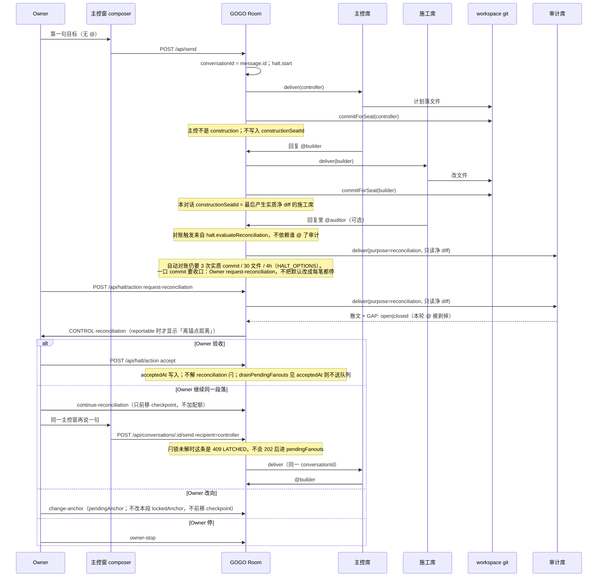

# GOGO PARTY 产品重设计：施工操作系统

| 字段 | 值 |
|---|---|
| 文档标题 | GOGO PARTY 产品重设计：施工操作系统 |
| 作者 | 施工主控草案；Owner 已拍板工人不得 @人 / 不自动绑 Claude / 第一枪 GOGO / Control Host |
| 日期 | 2026-09-11 |
| 修订 | 2026-09-11 r5（Owner 拍板：工人不得 @ 人；不自动绑 Claude；第一枪 GOGO 自施工；Control Host 进范围） |
| 状态 | Draft |
| 实现根 | `<gogo-party>` |
| 运行时起点 | `packages/room` + `packages/seat-runtime`（M1–M8 已闭合、未 push） |
| 不实现 | 合并 `<local>\NaveHQ` 代码；复制 Ekko/Hermes Studio；把 RongleCat Grok App 当 runtime |

---

## Overview

仓库里同时活着三个「Gogo 形」对象：NaveHQ 蓝图（只能判断、从未派过 agent）、charter/MVP（指挥中心 + Transition Engine + 自动接力 DAG）、以及真正在跑的 room（项目 = 群聊，`@` 是唯一调度器）。Owner 的产品句是「在一个对话框里对主控说明要做成什么，主控派给各家 agent，完成与审计由主控和审计控制」——它靠近前两套的身份，却必须落在第三套已经花钱跑通的运行时上。

本重设计选定**一个**产品：GOGO PARTY 是本地施工操作系统。Owner 只对主控席说话；主控在房间里用已有的 `@` 把工作派给官方 CLI 席位；独立审计席只读核对仓库事实。对账卡只回答「离锚点还差什么」（三栏齐全才能上报距离，永不因此变绿）；一段工作是否完成，只有 Owner 在该 `conversationId` 上点验收。第一份货物是内容电商系统，但第一个产品是这台施工 OS 本身。

---

## Background & Motivation

### 三个 Gogo 形对象（必须点名，必须选边）

| # | 对象 | 一句话 | 证据落点 | 命运 |
|---|---|---|---|---|
| 1 | **NaveHQ 蓝图** | Owner 只在两端；Plan / Delivery / Assurance；对账三栏不能由派活者打分；Loop Engineering | `<local>\NaveHQ\README.md` 冻结声明；`docs/navehq_target_blueprint_v1.0.md` §0–1.6；`AGENTS.md` 角色切分 | **冻结**。取其不变量，不复活校验器、Matching Layer、seq/task-card 剧场、CAO |
| 2 | **GOGO charter + MVP** | 多项目指挥中心；Implementer + 独立 Auditor；跑到下一人工 Gate；Proposal before promotion；绿灯绑证据；Codex 施工 → Grok 审计 | `docs/design/00-product-charter.md`、`01-domain-model.md`、`02-system-architecture.md`、`04-workflow-event-protocol.md`、`08-mvp-acceptance.md` | **历史意图**。对象模型与 Transition Engine 不进入 runtime。可复活的只有能在 room 里用席位策略表达的不变量 |
| 3 | **正在跑的 GOGO room** | 一个项目 = 一个群聊；席位；`@` 是调度器；没有 pipeline；M1–M8；halt；房间拥有 git commit；M7 family 门；人在房间里打 `@`；`openSeat` 是设置抽屉 | `START_HERE_CONTROLLER.md`；`packages/room/src/server.ts`；`halt-conditions.ts`；`public/index.html` | **唯一实现面**。`@` 调度与 halt 会计保留。§2 的「人与 worker 对等、Owner 自己 `@`」被本文件替换，见「文档权威」 |

`docs/design/31-product-design.md` 已经把*面向使用者*的故事拧成「你在群聊中间看着、随时插话」，给非写代码的人。Owner 的产品句不是这句话。群聊是战场投影，不是 Owner 窗口。

### 当前运行时实际是什么（不是文档说它是什么）

`packages/room/src/server.ts` 文件头写明：本文件不做调度，`@` 就是调度器。真实闭环：

1. `POST /api/send` → `parseMentions()` 从正文解收件人（`server.ts` 787–801 行）。没有 `@` 就没有派活。每条 send 把 `message.conversationId = message.id` 并 `haltController.start(message.id, …)`——**每一次 composer 发送都是新的 halt 窗口**。
2. 已有续话 API：`POST /api/conversations/:id/send`（`server.ts` 2072–2091 行）在同一个 `conversationId` 上再派一席，不新开窗口。`public/index.html` 的 `send()`（1914–1926 行）从不调用它。
3. `deliver()` 把 preamble + 正文写成 prompt 文件，交给 `PersistentCodexSeat` / `PersistentGrokSeat` / `PersistentClaudeSeat`。
4. 席位只改工作区文件。`commitForSeat()` 由房间署名提交（`Authored-by-seat` / `Committed-by: GOGO Room`）。Codex `workspace-write` 把 `.git` 排除在外——这是边界，不是缺陷。
5. 回复里再 `@` 下一个席位 = 接力。交接的是 `Material { baseCommit, headCommit, commits, changedFiles }`，不是聊天转述。
6. `roleKind()` 只认识 `施工|builder` 与 `审计|auditor|reviewer`。**没有主控角色。** M7 `evaluateIndependence()` 比较 `providerFamily`，同 family 标 `UNSATISFIED`，回复文字不能覆盖。施工主体是 fanout 传入的 `constructionSeatId`：外层 `/api/send` 把它设成 `runtimeRecipients[0]`（第一个 `@`）；后续跳只在「施工席 `@` 审计席」时把 `to` 传下去（989–992 行）。
7. `HaltController`（`halt-conditions.ts`，336 行）管预算、进展、对账闩锁、花费闸、Owner 喊停。`HaltReason = "low-progress" | "reconciliation" | "conversation-cost" | "daily-cost" | "owner-stop"`。进展是有界 +1，永不回满；`[继续]` 只前移 checkpoint。零号规则是硬拒绝，不生成 CONTROL 卡。
8. 实例池 `InstanceStore`：一实例同时只服务一席位。官方 CLI 在隔离 HOME 里跑。产品不搬凭据。
9. `openSeat(id)`（`public/index.html` 1636 行）打开的是**设置 + 私有 transcript 抽屉**，不是指挥官对话框。房间 composer 的 placeholder 是「随心输入」。chip 选中时 `send()` 会把缺失的 `@id` 拼进正文，因此服务器几乎看不到空 `recipients`。单 chip + 活跃回合走 `/api/seat/:id/interject`，不是 `/api/send`。终端 dock 是 xterm 重建的席位上下文，给会看终端的人。

共享工作区：`server.ts` 127–128 行写着独占 worktree 尚未实现。`dispatchFanout`（778–785 行）只在**同一次 fanout 的收件人里**串行 `workspace-write`、并行只读。跨对话、两次 `/api/send` 之间没有工作区锁；后一次 `commitForSeat` 覆盖前一次。

### 为什么必须重设计，而不是「明天怎么用当前房间」

- Owner 的产品句要求**一个**对话对象（主控），当前 UX 要求 Owner 自己当调度员打 `@`，且每次发送都新开 halt 窗口。
- charter 承诺绿灯绑证据；room 已经有 material 卡和 M7 徽章，但对账卡的 `verification` 是审计席自由散文。把「三栏字段存在」画成绿，会让「缺口巨大」的审计报告变成「已完成」。
- NaveHQ 用约 25,700 行 JS 校验器证明了：一个只能判断、不能执行的控制面会把自己当唯一被审对象。GOGO 的 `gogo-core` `TransitionEngine`（`crates/gogo-core/src/engine.rs`）是同一形状的 Rust 版：公开能力是 `decide()` 加一堆 `validate_*`，room 从不调用它。
- 第一份货物是内容电商。在没有「谁对谁说话、什么叫完成」之前设计商城，是用局部 UI 覆盖全局产品。

### 痛点（机制，不是感受）

| 痛点 | 机制 | 证伪测量 |
|---|---|---|
| Owner 必须自己 `@`，且每句新开窗口 | `/api/send` 无收件人则只提示「用 @ 指定席位」；`conversationId = message.id`；UI 不调 `/api/conversations/:id/send` | 无 `@` 的第二句话是否仍在同一个 halt 窗口 |
| 点开席位不像在对话 | `openSeat` 渲染花名册字段、登录、权限，transcript 垫底 | 点主控头像能否只看到 transcript、composer 是否续同一个 `conversationId` |
| 主控不存在 | `roleKind()` 返回 `construction \| audit \| null` | 花名册能否声明 `controller` 并约束其策略 |
| 对账与验收混为一谈 | 对账卡两栏散文，无 digest；没有 `accept` 动作 | 审计说「缺口巨大」时卡是否仍可被画绿；Owner 验收后 work dispatch 是否停止 |
| 施工主体跟第一个 `@` | `/api/send` 把 `constructionSeatId` 设为 `runtimeRecipients[0]` | Owner→主控→`@builder` 之后，对账 M7 是否仍是 `NOT_EVALUATED` |
| 施工与审计可以同家 | 仓库内 `packages/room/seats.json` 的 builder 与 auditor 都是 `providerFamily: openai` | M7 对这对组合必须是 `UNSATISFIED`（`GET /api/m7/evaluate` 已能证明） |

---

## Goals & Non-Goals

### Goals

- 给出一句能同时容纳 charter 身份、room 运行时、Owner 产品句的产品定义。
- 把「谁对谁说话」钉死：Owner ↔ 主控（**一个** `conversationId`）；房间时间线是派活战场；审计是只读核对窗。
- 拆开两个机器谓词：对账可上报 ≠ 工作完成。完成只有 Owner 验收动作。
- 角色是席位上的策略，不新造 Agent/Assignment/WorkflowRun 对象。实例池维持「一实例一席位」。
- 工人不得 `@` 人类席位。Owner 拍板只走主控窗 `conversationId`（CONTROL / accept / 对账）。
- 关浏览器不得改变在途任务权威（charter 桌面生命周期 / `docs/design/20-local-control-host-lifecycle.md` 的意图）。最小 Control Host：当前 OS principal 的 per-user 后台进程，不是 Windows Service；UI 只是客户端。
- 从 `packages/room` 的未 push M1–M8 起做可独立合入的 PR，不重写 216 篇设计文档。第一枪先在 GOGO 自己的仓库上证明闭环，再指向内容电商。

### Non-Goals

- 不把 NaveHQ 代码、CAO、Matching Layer、task-card / seq 剧场、25.7k 校验器迁入 GOGO。
- 不宣称已迁入 NaveHQ「任务卡通过题」。本阶段栏②是**目标锚点**，不是锁定的逐条通过题。
- 不对账第三栏做 NLP 判卷。作者硬（必须是异 family 审计席），内容软（自由散文 + 一行 `GAP: open|closed` 枚举）。缺枚举记 `unparsed`，不把它当「缺口已关」。
- 不启用 `crates/gogo-core` 的 Transition Engine 作为调度器。
- 不复制 Ekko Studio / Hermes Studio（BSL 1.1，`docs/research/reuse-blueprint.md` 已 `REJECT` 源码与 runtime 直连）。
- 不把 RongleCat/grok-app 的 App / RPC / IPC / store / native Session 接入 runtime（ADR-0008）。
- 不把 Gemini 做成 GOGO provider（Owner 已声明；`docs/design/32-gemini-adaptation.md` 仍缺登录肯定用例，且本重设计不把它升格）。
- 不捆绑 Cindy 式自带 `cc`/`codex`/`pi` 二进制；工人是本机已登录的官方 CLI。
- 不静默替换 ExecutionTarget（设计 19 的不变量保留；不实现 P40/P37/P41 那套 Registry/Broker）。
- 不新建 NL 分类器给任务自动挑 CLI。
- 不在本文件设计内容电商商城。那是这台 OS 建成之后的第一份货物。
- 不为「看起来完备」增加窗口/阈值/容差/兜底/加权/校准层。停止条件已经在 `HaltController` 里。
- 本阶段不添加跨对话的工作区写锁。独占 clone 是后继。
- 本阶段不实现 NaveHQ §1.2 第 1 种停机（不可逆真实代价→请 Owner 授权）。room 今天不能花钱、删数据、对外发布；零号规则是硬拒绝，不是授权卡。
- 不把 Control Host 做成 Windows Service，不随用户登录静默认领新工作（除非 Owner 显式打开「登录自启」——本阶段默认关）。
- 不实现 `gogo-core`，不把 design 20 的 SQLite / 四平面 / Attempt 对象一并复活。Host 就是正在跑的 room 进程（HTTP + 席位 + halt JSON）从浏览器生命周期里拆出来。
- 不自动把 Claude Max 5x 绑到主控或审计。厂商与实例只在使用时由 Owner 点。

---

## 产品定义

> **GOGO PARTY 是一台跑在 Owner 本机上的施工操作系统：一段目标一个 `conversationId`。默认对主控说明要做成什么，主控用 `@` 派给各家官方 CLI；Owner 也可打开审计、秘书会话（质询、整理），共用这段锚点与验收。独立审计只读核对仓库。对账三栏齐全才能上报「还差什么」，卡不能变绿；完成只有 Owner 在这段 CONTROL 上点验收。**

这句同时装得下三件事：

- charter：指挥的是施工，不是群聊社交；Implementer + 独立 Auditor；绿灯绑的是 Owner 验收记录，不是审计散文。
- room：席位、`@`、git 信封、halt、M7、隔离 HOME、官方 CLI、已有的 `conversationId`。
- Owner 句：默认对话框对主控并派发；审计可被质询；完成由审计核对 + Owner 验收。

它**不是**：把几个助手拉进群聊、你当另一个席位围观。那是 31 的获客外壳，也是当前 `index.html` 的默认姿态。获客外壳可留（第一次「让它说一句话」），产品身份不行。

第一份货物：内容电商系统。第一枪先在 GOGO 自己的仓库上证明闭环（`<gogo-party>` 或房间的 `.gogo/room-workspace` clone），再把 `GOGO_ROOM_WORKSPACE` 指到内容电商。商城是那个仓库里的项目，不是 GOGO 的第二套对象模型。

---

## 文档权威与历史化（不打马虎眼）

`START_HERE_CONTROLLER.md`：「没有流程。没有 pipeline、stage、workflow DAG、fan-in / fan-out、Transition Engine。`@` 就是调度器。」

`docs/design/00-product-charter.md` §3.4 / §5.4 与 `04-workflow-event-protocol.md` §6：人工按钮和自动事件调用**同一个 Transition Engine**；Result 经 Gate 物化后自动 `claimNext` 下一 Agent。

这两句不能同时为真。本产品站 START_HERE **调度器**这一边：`@` 是调度器，Transition Engine 不进 runtime。

START_HERE **§2 产品句**不能原样保留。原文是「一个项目 = 一个群聊房间。人和多个 worker 都是房间里的席位，任何席位可以 `@` 任何席位。」那是施工期身份，与 Owner 句冲突。落地时 §2 换成：

> 群聊与 `@` 是战场调度器。Owner 的窗口是主控席：同一 `conversationId` 里对主控说话，主控再 `@` 施工/审计。工人不得 `@` 人类席位；人的拍板只走主控窗。

M1–M8、halt 会计、房间 git 信封、隔离 HOME 仍以 START_HERE §3–§4 与代码为准。

| 文档 | 本重设计后的地位 |
|---|---|
| `START_HERE_CONTROLLER.md` §3–§7（M1–M8、halt、施工纪律）、`TASK-halt-conditions.md`、`docs/design/22-seat-runtime-inheritance-ledger.md`、`packages/room/**`、`packages/seat-runtime/**` | **运行时权威** |
| `START_HERE_CONTROLLER.md` §2 产品句 | **被替换**。调度器（`@`）留下，对等群聊身份不留下 |
| `docs/design/00` 已冻结意图 1–12 中可映射到席位/隔离/证据的部分；`19` 的「禁止静默替换」；`10-artifact-evidence-retention.md` 的「transcript 默认不是 Artifact 也不是 Evidence」 | **不变量，不当对象模型实现** |
| `docs/design/00` 北极星里的 Transition Engine 自动接力；`01` 的 WorkflowRun/Assignment/Attempt/CapacityPermit；`02` 四平面 + ResourceBroker；`04` 全文；`08` 作为 runtime 验收；`13` SQLite Coordination；`18` 把卡片当 Context Ledger 权威 | **历史**。解释我们为什么走到 room，不授权新代码 |
| `docs/design/20-local-control-host-lifecycle.md` | **历史输入**。Close window ≠ Quit、per-user 后台进程、不是 Service、UI 重连——这些意图进 PR J。不按其四平面/SQLite/Attempt 重写 room |
| `docs/design/31` | **获客与首次引导**（装 CLI、实例池、一席一实例、无终端退路）。不定义产品身份 |
| `docs/design/18` 的双层「Feed 是投影、Ledger 是权威」 | **精神保留**：时间线不是账本；账本是 git + halt snapshot + M7 字段。不引入 `ContextEntry` schema |
| NaveHQ `navehq_target_blueprint_v1.0.md` §1.1–1.5、对账三栏**意图**、角色切分 | **不变量来源**。代码保持冻结。停机集合以 room 实装为准，不把 NaveHQ 四种直接贴到 `HaltReason` |
| 本文件落地副本 `docs/design/35-construction-os.md` | **产品身份**（PR A 写入仓库） |
| `crates/gogo-core`、`crates/gogo-store`、`spec/draft/v1alpha1` | **内核实验遗物**。room 不链接、不启动、不「顺便修好」 |

START_HERE §6 已废除的三条（Owner `ACCEPTED` 前不得实现、独立 fresh audit `PASS`、contract-manifest digest 绑定）对本施工线仍然废除。本文件是产品设计，不是那套治理剧场的复活。

---

## Proposed Design

### 控制环（对账是 halt，回流只有 Owner）

NaveHQ 的 Loop Engineering 要求够格的工作流是闭环。charter 用 Transition Engine + DAG 表达它。room 用席位回复里的 `@` 做施工接力，用 `purpose=reconciliation` 做段落自检。这两段**不是**同一条自动环：

- 施工接力：`purpose=work`，回复里的 `@` 会继续 `deliver`。
- 段落对账：`publishPendingControls` 派审计席，`purpose=reconciliation`。`deliver` 在 `purpose !== "work"` 时把收件人剥空（约 918–923 行），然后闩上 `reconciliation`。审计席这一轮**不能** `@` 回流。未闩锁时审计 `@` 施工，只可能发生在有人用 `purpose=work` 去 `@auditor` 的路径上，不是三栏卡那条路。

本产品只画实际会发生的环：对账是 halt；回流是 Owner `[继续]` / `[方向要改]` 之后主控再 `@builder`。



主控 `@auditor` **不会**成为 M7 施工主体。对账派审计时用 halt 上记录的 `constructionSeatId`，不是本次 `@` 的发送者。

### 停机与完成：room 实装清单（不要再叫「四种」）

NaveHQ §1.2 的四种停机，与 `HaltReason` **不是**同一张表。本阶段以代码为准：

| 机制 | 实现 | 找 Owner？ | 本阶段 |
|---|---|---|---|
| 零号规则：能力/权限/模型请求 | `containsCapabilityRequest` 硬拒绝，不生成授权卡 | 否 | 保留 |
| `low-progress` | 预算归零闩锁；诊断一次 | 是（无锚点对话除外） | 保留 |
| `reconciliation` | 体量/墙钟 **或** Owner `request-reconciliation`；`[继续]` 只前移 checkpoint | 是 | 保留。自动阈值仍 3/30/4h |
| `conversation-cost` / `daily-cost` | 两张分开的花费卡 | 是 | 保留 |
| `owner-stop` | 只能被 `owner-resume` 解开 | 是（自己喊的） | 保留 |
| 不可逆真实代价请授权 | NaveHQ #1 | — | **不做**。系统尚不能花钱/删数据/对外发布 |
| Owner 验收 | `acceptedAt` + `accept`；前置 `reportable` | 是（收口） | **完成动作，不是 HaltReason**。之后 continue/改向/二次 accept 409 |

不把验收塞进 `HaltReason` 联合类型。不发明「再确认一下」卡。

### 谁对谁说话，以及「一段对话」是什么

**一段目标绑定一个 `conversationId`（halt 窗口），直到验收或 Owner 新开目标。** 默认派活对象是主控席。Owner **可以**打开与审计、秘书的会话（质询、整理、问缺口），这些会话共用这一段的锚点/对账/验收，不另开 halt 窗口。验收、`[对账]`、改向仍是这段 CONTROL，不因你正在跟审计说话而换一套完成语义。施工席默认不是规划同事：主路径是派出 + 插话，不是跟工人开目标会。

对象已经在 room 里：`HaltController` 的对话 id，以及 `POST /api/conversations/:id/send`。缺的是 UI 去调用它，以及 `/api/send` 的响应把 `conversationId` 交还给主控窗。

不新建 `/api/sessions`。

理由：

- Owner 句把「说明要做成什么」和「派发」分成两段。当前 room 把两段都压在 Owner 的 `@` 上，并且每句新开窗口，等于没有「一个对话框」。
- NaveHQ：聊天是 Owner 窗口，仓库是战场。映射：主控窗是 Owner 窗口，房间时间线 + git 是战场。
- 过滤「与主控有关的卡片」不是 halt 窗口。对账卡的 `[继续]` 作用在 conversation A；若第二句又走 `/api/send`，预算和锚点都在 B，A 的对账成为孤儿。

`config.human` 仍是时间线上 Owner 卡片的 `from: "human"` 显示身份，**不是**可被工人 `@` 的席位。工人回复里的 `@owner` / `@<human.id>` 按 `purpose !== "work"` 同样剥掉：不进 `recipients`、不形成 Attention、不 `deliver`、不 409 整轮（避免一句顺口的 `@owner` 废掉已写的材料）。Owner 拍板只走这段 CONTROL：`request-reconciliation`、`accept`、改向、停。跟审计/秘书说话不是拍板，不能写 `acceptedAt`，不能填对账第三栏。`parseMentions` 在 `deliver()`（工人回合）里把 human 当剥除，不当事先 `invalidRecipients` 去打扰 Owner。Owner 自己的 `/api/send` 若写 `@owner` 同样剥掉，不当收件人。

今天 `nextRuntimeRecipients` 已把 `"human"` 滤出 CLI 派发（`server.ts` 931 行），但仍会把人留在卡片收件人上。本拍板要求连这层 Attention 也去掉。

主控是**席位**，跑官方 CLI，不是 GOGO 自研模型。主控可以 `@` 施工/审计；主控**不能** `@` 人；主控**不能**填写对账第三栏，也**不能**成为 M7 施工主体。

本阶段一个房间恰好一个主控席。`controllerSeat()` 扫描花名册：零个则没有默认收件人；恰好一个则用它；两个及以上不得静默降成 `null`——启动打 SYSTEM_STATUS，POST/PATCH 再写主控 → 409。`roleKind` 是纯函数，只看这一条 `role` 字符串，不负责「第几份主控」。

### 角色 vs 席位（不新造对象）

```ts
type RoleKind = "controller" | "construction" | "audit" | "secretary";

function roleKind(role: string): RoleKind | null {
  // 按空白 / 斜线切出全部 token，各自匹配。
  // 命中两种及以上 → 调用方 POST/PATCH 返回 400 ROLE_AMBIGUOUS。
  // 「主控 / 审计」双命中，不取第一个 token 当主控。
  // 零命中 → null（通用助手）。roleKind 不看花名册里有几个主控。
}
```

| 策略 | 主控 | 施工 | 审计 | 秘书 |
|---|---|---|---|---|
| POST/PATCH 默认 `access` | **写入** `workspace-write` | **写入** `workspace-write` | **强制** `readonly` | **强制** `readonly` |
| 可被 Owner 打开会话 | 是（默认派活） | 插话/Run dock；不当规划会 | 是（质询、问缺口） | 是（整理战场、提醒） |
| 无 `@` 的 `/api/send` 默认收件 | 是 | 否 | 否 | 否 |
| `purpose=work` 时可 `@` 施工/审计/主控/秘书 | 是 | 是 | 是（回流算预算） | 是 |
| 可 `@` 人类席位 | **否** | **否** | **否** | **否** |
| 可写对账第三栏 | **否** | 否 | 是，且必须异 family | **否** |
| 可成为 `constructionSeatId` | **否** | 本对话中最后一次实质净 diff | 否 | 否 |
| `recordProgress` | 计划 `.md` 已排除；改代码则 +1，仍不是 M7 主体 | 净 diff 实质则 +1 | 不计 | 不计 |
| 一实例一席位 | 是 | 是 | 是 | 是 |

秘书：只读仓库，帮 Owner 看战场、拟人话摘要、提醒该对账；不能施工、不能验收、不能写栏③。没有秘书席不挡闭环。一房间至多一个秘书，第二份 409，与主控同规则。

不引入 Assignment、Attempt、lease、CapacityPermit。ExecutionTarget 不变量落在现有字段：`provider` / `providerFamily` / `model` / `instanceId`。换 CLI 走 `POST /api/seat/:id/provider`；换实例走 `POST /api/seat/:id/instance`。

### 施工主体（M7 跟材料，不跟第一个 `@`）

今天外层 fanout 把 `constructionSeatId` 设成第一个收件人。主路径变成 Owner→主控 之后，那个值是主控，`evaluateIndependence` 得到 `NOT_EVALUATED`，对账永不能 `SATISFIED`。

改为记在 `ConversationHaltState` 上，不靠调用栈：

```ts
// halt-conditions.ts
constructionSeatId?: string;

noteConstructionMaterial(id: string, seatId: string): void {
  // 仅当 roleKind(seat)==construction 且 isSubstantiveNetDiff(checkpoint..HEAD)
  // 主控、审计、通用席位都不写入。
}
```

`deliver` 在 `recordProgress` 之后，若本席是施工且净 diff 实质，调用 `noteConstructionMaterial`。`publishPendingControls` 和派 `purpose=reconciliation` 时用 `state.constructionSeatId`，**忽略**本次 `@` 的发送者。

`POST /api/conversations/:id/send` 今天把 `recipient` 当作 `constructionSeatId` 传入 `dispatchConversationFanout`（2087–2089 行）。必须改成传入（或忽略、改由）halt 上的值，否则主控窗续话会再次把主控写成施工主体。

没有施工材料的对话：M7 `NOT_EVALUATED`，对账不可上报，不能 `accept`。只有计划、没有施工，不是可验收的完成。

回归测试（在默认投递主控之前必须红、之后必须绿）：Owner 无 `@` → 主控 `@builder` → builder 实质 commit → 对账 M7 的 `constructionSeat` 是 builder，不是 controller。主控直接 `@auditor` 不得把主控写成施工主体。

### 三块表面（同一 DOM，一块布局）

不钉左侧三栏、不把 feed 切成三个后端。一块布局：

```
rail | main: topbar + feed（② 战场，不过滤）+ dock composer | drawer | settings | terminal-dock
```

**② 战场 = 现有 feed。** 所有 NOTE / RESPONSE / ACTIVITY / SYSTEM_STATUS / CONTROL、material、M7 徽章都在这里。主控 `@builder` 同时是「主控说了话」和「战场接力」——它出现在 feed 里，不复制到第二个列表。

**① 主控窗 = 聚焦态，不是新面板。** 点主控头像：drawer 只渲染该席 **transcript**（现 `GET /api/seat/:id` 已返回），设置折叠到抽屉底部按钮「席位设置」（登录仍只在 settings · 实例，31 已把登录从席位拿掉）。

聚焦的权威是 `GET /api/state` 的 `halt.conversations`，不是页面 RAM。加载 / 刷新：

1. 未 `acceptedAt` 的对话恰好一个 → 聚焦它。
2. 多个 → 取 `events` 里最近一次 `window-start`（即该对话 `start()` 时刻）。
3. 零个 → 无聚焦，下一句无 `@` 走新 `/api/send`。
4. 点该对话的 CONTROL 卡或主控 NOTE/RESPONSE → 写入聚焦。

`FOCUSED_CONVERSATION_ID` 只是投影。误开的第二扇窗口仍在 halt 里，点那张卡就能回来，不当孤儿扔掉。

**③ 审计窗 = 同一抽屉，换一个席。** 点审计头像：transcript-only + 当前聚焦对话的对账 CONTROL 卡字段（`git` / `lockedAnchor` / `verification` / `gap` / `reportable`）。只读。没有第二 composer。

终端 dock 仍是操作员诊断，不是 Owner 主路径。

#### Composer / chip / interject 矩阵

`send()` 今天（1914–1926 行）只有「恰好一枚 chip 且该席 `activeTurn` 且 `midTurnInterject`」才 `POST /api/seat/:id/interject`。主控窗稳态是无 chip；按今天的条件，主控跑着时 Owner 再打字会走 `conversations/:id/send` → 新 `deliver`/`sendPromptFile`，绕开 M5。

**插话不要求 chip。** 目标席 = 那一枚 chip，否则 = 主控。该席有匹配的 `activeTurn` 且 `midTurnInterject` → 一律 interject，原文不拼 `@`。Chip 只选「插谁 / 没有活跃回合时发给谁」。

| 条件 | 请求 | `conversationId` |
|---|---|---|
| 目标席（chip 或默认主控）有 `activeTurn` 且 `midTurnInterject`，`expectedTurnId` 匹配 | `POST /api/seat/:id/interject` `{ expectedTurnId, text }`。不经 `planDispatch`，闩锁中也走这条（M5：项目不用停） | `activeTurn.conversationId` |
| 无活跃回合，聚焦未验收的 C，work **未**闩锁，无 chip 或 chip=主控 | `POST /api/conversations/C/send` `{ recipient: 主控 id, text }` | C |
| 同上，一枚非主控 chip | `POST /api/conversations/C/send` `{ recipient: 该 chip, text }` | C |
| 无活跃回合，聚焦 C，但 C 的 work 闩锁（`reconciliation` / `low-progress` / 花费 / `owner-stop` / `acceptedAt`） | **409 `LATCHED`**。不 push NOTE，不进 `pendingFanouts`，不 202。提示先继续/改向/验收 | 仍是 C |
| 无聚焦对话（halt 里没有未验收窗口），无 chip 无 `@`，花名册有唯一主控 | `POST /api/send` `{ text }`（服务器填主控） | **新**窗口；响应带 `conversationId` |
| 无聚焦对话，正文或 chip 已有 `@` | `POST /api/send` 如今天（拼 `@`） | 新窗口 |
| 无主控席且无 `@` | 今天的系统提示「用 @ 指定席位」 | 无 |
| 多 chip 且无插话 | 本阶段只允许在**新** `/api/send` 上扇出。续话 API 仍单 `recipient` | 新窗口 |

composer 工具条增加 **[对账]** → `POST /api/halt/action` `{ action: "request-reconciliation", conversationId: 聚焦 }`。无施工材料 → 409 `NO_CONSTRUCTION_SUBJECT`。无异 family 审计席 → 409 `NO_INDEPENDENT_AUDITOR`（**先于** latch）。已闩且已 `reportable` → 409 `ALREADY_LATCHED`。已闩且尚未 `reportable` → 再走同一条审计路径，不二次 latch。

有 chip 时服务器收不到空 `recipients`。无 chip 时**不要**自动选中主控 chip（否则永远走不到服务器默认，也永远看不出「默认主控」）。插话看的是目标席的 `activeTurn`，不是 chip 是否点亮。

验收之后：halt 里该对话已有 `acceptedAt`，加载规则不再聚焦它。下一句无 `@` 走 `/api/send` 开新窗口。

### 完成定义：两个谓词，一张卡不涂绿

不新增 workflow 对象。对话仍是 `HaltController` 的 `ConversationHaltState`。

**谓词 1 — `reportable`（对账可上报「前进了多少 / 还差多少」）**

```text
reportable ⇔
    ¬anchorPending
  ∧ lockedAnchor 非空
  ∧ git.diffDigest 由房间对 checkpoint..HEAD 算出
  ∧ verification 来自 roleKind=audit 的 purpose=reconciliation RESPONSE
  ∧ independence.status = SATISFIED
  ∧ independence.constructionSeat = state.constructionSeatId
```

`reportable` **只**解锁对账卡上的距离陈述。它不是绿，不是 DONE，不是 `[继续]`。审计正文写「什么都没做完、缺口巨大」时，只要三栏在，仍然 `reportable=true`。这是 NaveHQ §1.3 的报账，不是 §1.1 的结尾验收。

自动对账触发保持今天的 `HALT_OPTIONS`：`reconciliationCommits` 默认 3、`reconciliationFiles` 30、`reconciliationMs` 4h（`server.ts` 445–450）。**不把默认改成 1**：每笔实质 commit 都停，违反「默认自动，例外才停」，也会打歪 halt A1–A9 的窗口形状。一口施工要收口，走 Owner `request-reconciliation`：同一条 `publishPendingControls` / `purpose=reconciliation` 审计路径，不另做验收引擎。

**谓词 2 — `accepted`（Owner 验收）**

```text
accepted ⇔ halt.acceptedAt 已由 POST /api/halt/action { action: "accept" } 写入
前置：该 conversation 当前 reportable
效果：写入 acceptedAt；**不** unlatch reconciliation（continueAfterReconciliation 仍是解开该闩的唯一动作，验收后它对 Owner 是 409）；
      planDispatch 凡 kind=work 见 acceptedAt → allowed=0（remaining 不回满，+1 公式不改）；
      drainPendingFanouts 见 acceptedAt → 直接 return，不送 pendingFanouts；
      continue-reconciliation / change-anchor / request-reconciliation / 二次 accept → 409 ACCEPTED；
      该 CONTROL 卡 actions 清空，标明已验收；
      下一句目标必须新 /api/send
```

审计散文、主控散文、`[继续]`、三栏齐全，都不能写 `acceptedAt`。没有 `request-reconciliation`（也没撞上自动阈值）就没有审计 RESPONSE，就不能 `accept`——验收不能挂在「碰巧满 3 次 commit」后面，但必须经过同一条独立审计路径。

绿只绑定 `acceptedAt`。对账卡即使 `reportable` 也保持 CONTROL 样式，不涂绿。charter §5.5 在这里落地：面板不得从自然语言推断已完成。

**栏② 叫目标锚点，不叫通过题。** `isQualifiedAnchor` 只拒绝短句和「开始吧」。NaveHQ 的「开始前锁定、不可事后改到已完成的活上」用下面这条最小规则表达，不引入 task card：

- `start()`：合格锚点写入 `lockedAnchor`（以及今天的 `anchor`）。
- `changeAnchor`：写入 `pendingAnchor`，**不**改 `lockedAnchor`，不前移 checkpoint（已有）。
- `continueAfterReconciliation`：前移 checkpoint；若有 `pendingAnchor` 则把它抄进 `lockedAnchor` 并清空 pending。也就是：改向在 Owner `[继续]` 时开启下一段尺子，本段对账仍用旧尺子。

**栏③ 作者硬、内容软。** 对账 prompt 要求审计席第一行是 `GAP: open` 或 `GAP: closed`。房间解析为 `gap: "open" | "closed" | "unparsed"`。`unparsed` 仍可 `reportable`（有独立散文），但不能显示「缺口已关」。不把这一行当成 NLP 判卷。

对账 CONTROL 卡形状：

```ts
control: {
  kind: "reconciliation",                 // 仍是 HaltReason，不新增 kind
  conversationId,
  actions: [
    { id: "continue-reconciliation", label: "继续（不加配额）" },
    { id: "change-anchor", label: "方向要改" },
    { id: "owner-stop", label: "停一下" },
    { id: "accept", label: "验收这一段" },  // 仅 reportable 且未 acceptedAt
  ],
  lockedAnchor: string,
  git: { checkpoint, head, diffDigest, files },
  verification: string,
  gap: "open" | "closed" | "unparsed",
  independence: Independence,
  reportable: boolean,                    // 不是 complete，禁止叫 complete
}
// acceptedAt 之后：actions = []，文案标明已验收。绿只来自 acceptedAt，仍不把 reportable 涂绿。
```

旧卡缺字段 ⇒ `reportable=false`。不迁移历史 JSON 变绿。

**不得写成已验收：**

- 任何席位正文里的「做完了」
- `reportable=true`（含审计说缺口已关）
- 同 family 审计、`NOT_EVALUATED`、主控写的 verification
- 只有叙述性 `.md` 的净 diff
- Owner `[继续]`
- 诊断回合
- transcript（`docs/design/10-artifact-evidence-retention.md`）

没有施工材料 ⇒ `request-reconciliation` 与 `accept` 都 409。`[继续]` 仍只走 `continueAfterReconciliation`，且 `acceptedAt` 之后 409。

### 从运行中的 room 保留什么 / 从 charter 复活什么 / 让什么死掉

**保留（已经在跑，禁止以重设计为名拆掉）：**

- `packages/seat-runtime`：官方 Codex app-server、Grok ACP、Claude stream-json；隔离 HOME；`assertSeatHomeSafe`；密钥/endpoint/沙箱逃逸环境变量剥离。
- `@` 调度、`parseMentions`、`deliver` 接力、同一次 fanout 内写者串行。
- 房间 git 信封、`Material` 卡。
- `HaltController` 零号规则与五条 `HaltReason`；有界 +1；A1–A9 测试。A1 用 `"controller"` 当非法 `@`（`halt-conditions.test.ts` 第 12 行）——席位 id 不要取 `controller`，用 `lead` / `main` 等。
- M7 `evaluateIndependence` + `GET /api/m7/evaluate`。
- `POST /api/conversations/:id/send`（补上 UI 与施工主体）。
- 实例池、一席一实例、无窗口 OAuth、产品代装 CLI、首次引导骨架。
- 审计启动只读硬拒绝。
- 多项目切换（`ProjectRegistry`）、多房间（`RoomRegistry`）。
- START_HERE 的施工纪律：改 `seat-runtime/src` 必须 build dist；提示词走文件不进 argv。

**复活（只复活不变量，不复活对象）：**

- Owner 在两端（开头给方向、结尾验收）。验收是 `accept` 动作。
- 对账三栏**意图**：git 不经主控之手、尺子不事后改到本段、缺口判断非派活者。栏②本阶段是锚点不是通过题。
- Proposal before promotion：席位输出是 RESPONSE；绿只有 `acceptedAt`。
- Implementer 与 Auditor 异 family（M7）。
- 禁止静默替换执行身份（设计 19；换 CLI 已有确认框。observed model 见 PR I，不在完成路径上）。
- 人随时可停（`/api/halt/room`）。

**让它死：**

| 死物 | 为什么死 |
|---|---|
| Transition Engine / `gogo-core` 进 room | 与 `@` 调度互斥；历史上从未成为可执行产品 |
| Workflow DAG、fan-in/fan-out quorum、`claimNext` | 施工接力由 `@`；对账由 halt |
| Task card / seq / CAO / Chief of Staff | NaveHQ 剧场 |
| Matching Layer、NL 路由 CLI | 禁止；Owner 在花名册上点席位 |
| SQLite Coordination Store 作为产品脊柱 | `seats.json` + `timeline.json` + `halt-state.json` |
| Local Control Host 当 Windows Service | 禁止。PR J 是 per-user 后台进程，不是 Service |
| 工人 `@` 人当 Attention | Owner 拍板：拍板只走主控窗 |
| ContextEntry / CollaborationProposal 权威化 | 18 自己也说卡片不是总线 |
| Cindy 捆绑二进制、Ekko 复制、Grok App runtime | 见竞品节 |

### 从市面融入什么（不是再否决一遍）

对照过的产品里，**机制能进房间的就收进来**，只拒绝会拆不变量的壳（捆绑 CLI、画布 DAG、人当舰队司令、NL 分类器、静默换家）。

| 来源 | 收什么 | 落在哪 | 不收什么 |
|---|---|---|---|
| **CodeFleet** | 派出 chip +「此刻」dock；CONTROL 上本段派出清单（谁、状态、一句任务）；composer 上 ready/在跑/闩锁；Files/Git 图标轨；托盘活动中心 | UI：36 / PR F–F2；托盘：PR J | 四分割当首页；人自己 `@` 所有工人当主路径 |
| **Cindy** | 角色会话可并排、可把另一席链接丢进输入；彩色只表示在跑；**主控 `@` 之后不等待**（继续说话或插话）；diff **逐条**可看 | UI：36；主控不等待：已有 M5 + fanout 不阻塞 `/api/send`，UI 禁止转圈锁死主控 composer | 随包 `cc`/`codex`；同一任务静默换 Harness |
| **Conductor** | Diff 是一等审查面，不靠终端看材料 | 图标轨 Diff；可对 hunk 标记「看见了」（不改 git 信封，房间仍是唯一 committer） | 人审替代审计席 |
| **Claw Autoloop / orchflows / HAR** | **机器验收**：仓库若有可跑的检查（`package.json` test / 已声明的 verify 命令），对账路径上跑一遍，结果进 CONTROL 的 `verify` 字段。`accept` 仍是人点；有检查且失败时 `accept` 409 `VERIFY_FAILED`（可强制验收需另按，本阶段不做强制旁路） | PR C 或紧随的 **PR K**。没有检查命令则 `verify: skipped`，不挡第一枪 | 用 LLM 当「测试过了」；另起 Verification 微服务 |
| **Claudexor / gogousage** | 同厂商多实例：**额度多的优先**（next-up）；对话粘在已开的实例上；换实例必须明说，禁止换厂商当续话 | 实例池已有；**PR L** 读官方用量（Codex/Grok/Claude 已有 probe）写 `next_up`，花名册只读展示 | 静默把 Codex 续话接到 Claude |
| **charter 盲审 + Codex Peer Review** | 可选第二审计席（仍须异于施工 family）。第一枪一个审计。Reveal 前两审计不可见彼此正文 | 本阶段只留花名册可以有多个 `audit`；M7 取与施工异 family 的那一个做栏③。多审计闸排第一枪之后 | 三个审全过才能合的插件流程当产品脊 |
| **orchflows tickets** | 这段目标可物化成工作区 `.gogo/conversations/<id>.md`（锚点、digest、gap、verify），会话死了人还能在 git 里看见 | PR C 可选写文件；**不是**完成权威（权威仍是 halt JSON + git） | ticket 驱动 `claimNext` |
| **CodeFleet / Conductor / HAR worktree** | 多个施工席并行时每人一 worktree，房间再收编 | **第一枪之后**。现在同 fanout 写者仍串行、共享 `GOGO_ROOM_WORKSPACE` | 用 worktree 绕过房间 git 信封 |
| **Claude Agent Teams 邮箱** | 席位互相 `@` 已经是邮箱 | 已有 | 队友共享任务板 DAG |
| **Grok Bot「只为决定回来」** | halt 闩锁 + CONTROL 卡已经是这个 | 已有 | 云端电脑当工人 |
| **AgentsRoom / Factory kanban** | — | 不进首页 | 角色网格当调度器 |
| **Ekko 工作流画布、AGW 分类器、CAO tmux** | — | 不进 | 已否决的控制面 |

**完成谓词补一刀（来自 Claw/orchflows，对齐蓝图「通过题」而不复活 task card）：**

```text
accept 前置 = reportable ∧ (verify.status == "ok" ∨ verify.status == "skipped")
verify.status == "failed" → 409 VERIFY_FAILED
无声明的检查命令 → skipped（第一枪 GOGO 仓库有 pnpm test:halt，应跑这一条）
```

`verify` 由**房间**执行（和 git digest 一样不经主控之口），不是审计散文。审计仍写缺口；机器检查仍是房间事实。两者都在 CONTROL 上，都不涂绿。

主控不等待：`@builder` 之后 Owner 仍可对主控说话、可插施工；UI 不得用全屏 spinner 挡住 composer。这是 Cindy「主 Agent 不空等」在 `@` 调度下的对应。
| Gemini provider | Owner 已排除 |
| 对账卡字段名叫 `complete` | 与验收撞名，已改 `reportable` |

### 比 Cindy 多什么、比 NaveHQ 少什么

Cindy / Ekko / Grok Bot / Claw / orchflows / CodeFleet 的产品行为来自本轮会话研究，未在本修订中重新打开那些仓库。GOGO/NaveHQ 侧的对照以本仓库与 `<local>\NaveHQ\README.md` 为准。

**比 Cindy 多：** 官方 PATH CLI 而非捆绑二进制；M7 跨 `providerFamily`；房间 git 信封；halt 有界 +1；一实例一席位强制闸。

**比 NaveHQ 少：** 没有独立于执行的判断平面；没有 task card / Matching / 校验器堆；完成证据是 git digest + Owner `accept`，不是刮屏。对账可上报不是「已完成」。

| 产品 | 它是什么 | GOGO 不跟它走的点 |
|---|---|---|
| Cindy | 单 companion；捆绑 CLI；协同模式 commander/writer/QA | 不捆绑；identity 在席位 `@id`；M7 跨厂商 |
| Ekko Studio（ex Hermes） | 工作区产品；群 `@` + Vue Flow DAG | 已 REJECT 复制；DAG 不是调度器 |
| Grok Bot | 云电脑队友；关笔记本继续跑 | 本地 CLI 席位。关浏览器 ≠ 停 Host（PR J）；关 Host / 注销仍停。不是云电脑 |
| Claude Code Agent Teams / Codex subagents | 同家编排 | 同厂商不能过 M7 |
| Claw Autoloop | 跨引擎 + Verification Plane | 精神接近。GOGO：三栏=可上报，`acceptedAt`=verified completed |
| orchflows | orch-do vs orch-judge | 三栏意图相同；票证是 git 与 halt 状态 |
| CodeFleet / Agentrove | lead 聊天派给已装 CLI | 最近外形。GOGO 多出 git 信封、halt、M7、审计只读、一个 conversationId |

### Owner 账号拓扑（派活建议，不是自动路由）

现有：4× GPT Plus、1× GPT 20x Pro、2× Claude Pro（拟合并 Claude Max 5x）、4× SuperGrok、8× Gemini Pro（GOGO 不用）。官方 CLI：Codex、Claude Code、Grok Build。

花名册由 Owner 点。**不自动选厂商。** Claude Max 5x 合并完成后不默认绑主控或审计；用到那一席时再绑实例。

建议的手工拓扑（写在说明里，不写进调度代码）：

- 主控：Pro/Max 档，persistent。席位 id 不要用 `controller`（A1 噪音测试用了这个假名）。
- 施工：Plus / SuperGrok，每席自己的实例。
- 审计：必须与 `constructionSeatId` 不同 family。
- `packages/room/seats.json` 双 openai 是作者工作副本，不是产品默认。空数据根种子 `seats: []`（`server.ts` 211–227 行）保持空。

Gemini 只出现在「还没支持」文案（31 §4.3）。

### 共享工作区（诚实边界）

同一 fanout 里多个 `workspace-write` 收件人会排队（`dispatchFanout`）。除此之外：

- 主控 `@builder` 是先后两跳，所以**这一条路径**不会并行写。
- 两个 Owner 发送、两个 halt 窗口、主控窗与战场同时 send，**没有**全局队列。后一次 `commitForSeat` 赢。
- Owner 文案不要写「会排队」。可以写「同一条 `@` 里的多个可写席会一个一个来；两句话之间可能互相覆盖」。
- 本阶段不添加 workspace mutex。独占 clone 后继。

### 第一枪仓库（已拍板）

先在 GOGO 自己的仓库上跑通「主控 → 施工 → 异 family 对账 → `accept`」：工作区是 `<gogo-party>`，或 `pnpm room:start` 默认的 `.gogo/room-workspace` clone。证明闭环之后，再设 `GOGO_ROOM_WORKSPACE` 指向内容电商仓库。不把商城当第一枪。

### 最小 Control Host（已拍板，A–G 之后）

关浏览器不得改变在途任务权威。今天 `packages/room` 的 Node HTTP 进程已经养着席位；缺的是把「关窗口」和「退出 Host」分开，以及 UI 当客户端重连。

| 做 | 不做 |
|---|---|
| 当前用户的后台进程，单实例，绑定 `127.0.0.1` | Windows Service |
| Close window：UI 走，Host / 席位 / halt JSON / `acceptedAt` / 在途 turn 留下 | 关标签即 `shutdown` |
| Quit：有界停席位再退 Host | 假装云电脑、关笔记本继续 |
| 再打开 UI 连同一 Host，从 `GET /api/state` 恢复聚焦 | 第二套 Control Plane、SQLite、gogo-core |
| 登录自启默认关 | design 20 的四平面 / Attempt / 通知产品 |

`docs/design/20-local-control-host-lifecycle.md` 只作 Close≠Quit 与 per-user 进程的历史输入。PR J 在 A–G 假 Party 闭环之后，不挡第一枪。

### 首次引导与 31 的关系

31 的主线保留。改产品语义时必须一起改这些现成字符串，不只改 `FIRST_SEAT_ROLE`：

| 今天 | 改为 |
|---|---|
| `FIRST_SEAT_ROLE = "助手"`（`onboard.ts` 91） | `"主控"` |
| `FIRST_SEAT_DEFAULTS.*.id = "assistant"` | `"lead"`（避开 A1 的 `controller` 假名） |
| `systemHint: 你是…通用助手`（`server.ts` 2889） | 主控提示：对 Owner 说话、计划落仓、需要干活时 `@` 施工席；**不要 `@` 人类席位** |
| `onboard.test.ts` 断言 `FIRST_SEAT_ROLE === "助手"`、`tryText("assistant")` | 同步改 |
| `blankState()` / `quick()` 填 `@builder … @auditor 复核` | 无 `@` 对主控说目标；第二张建议「加一个异 family 审计席」 |

试跑仍 `@lead` 说一句话、`noRelay: true`，与「第一分钟证明 CLI 活着」相容。试跑成功后才建议加施工/审计。没有异 family 审计可以聊天，不能 `accept`。

引导一旦把第一席位写成主控，「没有主控席 = 旧行为」只适用于**升级前**已有的数据根。新 clone 从第一席位起就是新行为。这要写进 rollout，不要假装 flag。

---

## API / Interface Changes

现有网关全部在 `packages/room/src/server.ts`。不新起 Control Plane 进程。不新建 `/api/sessions`。

### `roleKind` 与建席

```ts
function roleKind(role: string): "controller" | "construction" | "audit" | null
// 切全部 token；双命中由 POST/PATCH 变成 400 ROLE_AMBIGUOUS。roleKind 本身可返回
// 单一命中或 null，不在纯函数里偷偷把第二份主控打成 null。

function controllerSeat(): SeatSpec | undefined {
  // 花名册里 roleKind==controller 的席：0 → undefined；1 → 那一个；≥2 → undefined
  // 并在 boot 打 SYSTEM_STATUS，不改 seats.json。
}

// POST /api/seats 今天不写 access，默认启动只读。
// 必须在 POST 与 PATCH 都做：
//   controller | construction → 若 body 未带 access，写入 workspace-write
//   audit → 强制 readonly（今天 POST 没有 AUDIT_SEAT_MUST_BE_READONLY）
// 双角色字符串 → 400 ROLE_AMBIGUOUS
// 已有一个主控时再 POST/PATCH 成主控 → 409
```

### `POST /api/send`：开窗口 + 默认主控

```ts
// recipients 为空且存在唯一主控 → recipients = [controllerId]
// 仍 start(message.id, body, HEAD)；仍 conversationId = message.id
// 响应必须带 conversationId（今天只回 { ok, recipients }）
// 不要把 controllerId 当作 constructionSeatId 传入 dispatchConversationFanout
json(res, 200, { ok: true, recipients, conversationId: message.id });
```

无主控且无 `@`：保持今天的系统提示。

### `POST /api/conversations/:id/send`：主控窗续话

已存在。改三处：

1. `constructionSeatId` 参数改为 `haltController.get(id).constructionSeatId`，不要用 `recipient`。
2. 未知 id → 404。`acceptedAt` → 409 `ACCEPTED`，强迫 UI 走新的 `/api/send`。
3. work 闩锁（`latches` 非空）且本请求不是插话 → **在 `push` NOTE 之前** 409 `LATCHED`，列出当前闩锁。不 202、不进 `pendingFanouts`（今天 1077–1081 行在 `allowed===0 && hadLatch` 时静默入队；Owner 续话不得再用这条）。席位之间已入队的 fanout：`[继续]` 仍可 `drainPendingFanouts`；**`accept` 之后 drain 必须因 `acceptedAt` 直接 return**，否则解开或清空闩锁会把已验收对话上的工人 `@` 送出去。

请求体保持 `{ recipient, text, replyToId? }`。无 chip 时 `recipient` 为主控 id。

插话不走这支：见矩阵，`POST /api/seat/:id/interject`（已有，2328–2361 行）不经 `planDispatch`。

### `POST /api/halt/action`：对账请求与验收

现有 action：`resume-low-progress` | `continue-reconciliation` | `change-anchor` | `add-conversation-budget` | `add-daily-budget` | `owner-stop` | `owner-resume`。

新增 `request-reconciliation`：

- `acceptedAt` → 409 `ACCEPTED`
- 无 `constructionSeatId` → 409 `NO_CONSTRUCTION_SUBJECT`
- `auditSeatFor(constructionSeatId)` 为空（无审计席或与施工同 family）→ 409 `NO_INDEPENDENT_AUDITOR`。**此时不得 latch**（今天 `publishPendingControls` 在没有 hetero 审计时仍出卡、verification 停在「对账调用尚未完成。」，会把收口钉死）
- 已在 `reconciliation` 闩上 **且** `reportable===true` → 409 `ALREADY_LATCHED`（用已有卡）
- 已在 `reconciliation` 闩上 **且** `reportable===false`（缺审计、花费闸挡住了 `planDispatch("reconciliation")`、同 family 刚改成异 family）：再走同一条 `purpose=reconciliation` deliver。不二次 latch、不调用 `recordProgress`、不加 `remaining`。`planDispatch("reconciliation")` 仍计付费次数（受花费闸约束）
- 未闩：与自动对账命中后同一路径（latch、派审计、publish CONTROL）。**不**改 `reconciliationCommits` 默认 3

新增 `accept`：

- `reportable` 为假 → 409 `NOT_REPORTABLE`
- 写入 `acceptedAt`。**不解** `reconciliation` 闩（`unlatch` 仍只有 `continueAfterReconciliation`；验收后该动作对 Owner 409，所以闩会留到对话结束）
- `planDispatch(..., "work")` 见 `acceptedAt` → `allowed=0`
- `drainPendingFanouts` 见 `acceptedAt` → 立即 return，即使 `latches.length===0` 也不送队列。测试：验收时 `pendingFanouts` 里有工人 `@` → drain 不得 `deliver`
- 随后 `continue-reconciliation` / `change-anchor` / `request-reconciliation` / 二次 `accept` → 409 `ACCEPTED`
- 该 CONTROL `actions` 清空
- 不加配额、不前移 checkpoint、不改 `HaltReason` 联合类型、不改 +1 公式
- UI 按钮 id 与 action 同名 `accept`

`change-anchor` 改为写 `pendingAnchor`（见完成定义）。未验收时语义不变。

### 对账卡字段

`Card.control` 增补 `lockedAnchor`、`git`、`gap`、`independence`、`reportable`。禁止字段名 `complete`。

### 施工主体写入点

`deliver` 在实质净 diff 且 `roleKind==construction` 时 `noteConstructionMaterial`。`publishPendingControls(context, state.constructionSeatId)`。

### 明确不增加的 API

- `/api/sessions`、`/api/assignments`、`/api/workflows`、`/api/gates`
- Matching / route / classify
- 把 NaveHQ validator 以 HTTP 暴露

---

## Data Model Changes

| 文件 | 职责 |
|---|---|
| `seats.json` | 花名册。`role` 可识别主控；POST 起写入默认 `access` |
| `timeline.json` | 卡片。`control.reportable` / `git` / `gap` 可选 |
| `halt-state.json` | 现有 snapshot + `constructionSeatId` + `lockedAnchor` + `pendingAnchor` + `acceptedAt` |
| workspace git | 材料与对账栏① |

`+1` 会计公式不改。不引入 SQLite。不把 ExecutionTarget digest 写成新表。

迁移：无。缺新字段的旧 halt 窗口：`reportable=false`，不能 `accept`。空数据根仍种子空花名册。

Retention：transcript 不是 Evidence。验收绑定 `acceptedAt` + 当时的 `git.diffDigest`，不是 transcript 全文。

---

## Alternatives Considered

### A. 保持「Owner 是群聊 peer」，只把主控/审计钉成抽屉

与 31、当前 `openSeat` 一致，改动最小。放弃：Owner 产品句被局部 UX 覆盖；每句仍新开 halt 窗口。

### B. 复活 Transition Engine + charter 对象模型，把 room 当 UI 壳

放弃：START_HERE 已用可执行产品证伪；room 从不 import `gogo-core`。

### C. Cindy 路线：捆绑 CLI，单一 companion

放弃：与官方 CLI 身份、一实例一登录、M7、git 信封冲突。

### D. 主控不是席位，而是 room 进程内规则

放弃：Matching Layer 缩小版；计划不能落仓给下一席位读。

### E. 保持「一句一个 halt 窗口」，不用会话语言

诚实，但无法实现「一个对话框里把事做完」。已有 `POST /api/conversations/:id/send` 就是为续话准备的，UI 没接。选它，不新造 session 对象。

选定：主控是席位；第一句 `/api/send` 开窗口；其后主控窗走 `/api/conversations/:id/send`；`@` 仍是调度器；对账可上报与 Owner 验收是两个谓词。

---

## Security & Privacy Considerations

| 威胁 | 严重度 | 缓解 |
|---|---|---|
| 席位要写权限/换模型 | 高 | 零号规则硬拒绝 |
| 审计席可写 | 高 | 启动 409；POST 起强制 readonly |
| 席位自己 commit | 高 | 沙箱排除 `.git`；房间署名 |
| 真实 HOME 当席位 HOME | 高 | `assertSeatHomeSafe`；实例在盘符根 `gogo-party-instances` |
| refresh token 轮转 | 高 | 一实例一席位 |
| 密钥进 timeline | 中 | `mask.ts`；seat-runtime 剥离密钥/BASE_URL/沙箱逃逸变量 |
| 主控诱导 Owner 点验收 | 中 | 验收按钮只在 `reportable` 时出现；卡不因三栏变绿；建议栏禁祈使句 |
| 同厂商审计冒充独立 | 中 | M7；`reportable` 要求 `SATISFIED` |
| CSRF | 中 | `127.0.0.1`。不把 Host 改成可远程 |

产品不读、不写、不复制凭据。

---

## Observability

- 时间线：派活、失败（`reportSwallowed` 必须成卡）、material、M7、CONTROL。
- `GET /api/state` 的 `halt`：`remaining`、`latches`、`constructionSeatId`、`acceptedAt`、`lockedAnchor`。
- 对账卡 `reportable` 与 `git.diffDigest`：能数「可上报的对账」和「已验收对话」，不要数 task card，也不要把前者叫做完成率。

告警 = CONTROL 卡。回归：

```
pnpm --filter @gogo/room test:halt     # A1–A9 必须继续全绿
pnpm test
```

新增攻击必须可执行：无 `@` 第二句仍在同一 `conversationId`；施工主体是 builder 不是 controller；`reportable` 不涂绿；缺栏不能 `accept`；主控 verification 不能上报。

---

## Rollout Plan

当前 `main = 558f4ce`，M1–M8 闭合，**未 push、未 release**。重设计在这条未发布线上长。

顺序见 PR Plan：A–G 假 Party 闭环 → 第一枪在 `<gogo-party>`（或 room-workspace clone）真 CLI 跑通主控→施工→异 family 对账→accept → 再 `GOGO_ROOM_WORKSPACE` 指内容电商。PR J（Control Host）在 A–G 之后，不挡第一枪。

「没有主控席 = 旧行为」只适用于 PR E 之前的数据根。halt 与 M7 不回退。

发布门仍是 M8：陌生人只读 README 能建席位跑通一轮。重设计后这一轮是主控说一句话。关浏览器不应中断在途回合（PR J）。

---

## Risks

| 风险 | 严重度 | 缓解 |
|---|---|---|
| 跨对话写冲突 | 中 | 文案诚实；不假装全局排队 |
| 主控计划 `.md` 灌水 | 低 | 叙述路径不计进展，也不写入 constructionSeatId |
| UI 仍每句 `/api/send` | 高 | PR F 合入前主控窗不算完成；续话测试必须红 |
| 把 `reportable` 再画成绿 | 高 | 字段禁止叫 `complete`；UI 绿只绑 `acceptedAt` |
| 把施工主体做成小 DAG | 高 | 一个可选字段，写在 halt 状态上 |
| M1–M8 腐烂 | 高 | 每 PR `test:halt` 全绿 |

---

## 已拍板

Owner 2026-09-11 终裁，不再讨论：

1. **工人不得 `@` 人类席位。** 全部拍板走主控窗。`deliver()` 剥 `@owner` / `@<human.id>`，不形成 Attention。Owner 只对 `conversationId` 里的主控说话。
2. **Claude Max 5x 不自动绑主控或审计。** 用时再绑。调度代码不选厂商。
3. **第一枪是 GOGO 自己的仓库。** `<gogo-party>` 或 `.gogo/room-workspace` clone 上证明「主控→施工→异 family 对账→accept」，然后才 `GOGO_ROOM_WORKSPACE` 指向内容电商。
4. **后台 Control Host 进范围。** 关浏览器不改变在途权威。最小形态：per-user 后台进程，不是 Service；UI 重连；halt / conversation / `acceptedAt` / 席位活过关窗。PR J 在 A–G 之后。不实现 gogo-core。`docs/design/20-local-control-host-lifecycle.md` 只作历史输入。

---

## Key Decisions

1. **产品是施工 OS。** 身份取 Owner 句 + charter 的 Implementer/Auditor；实现取 room。货物是内容电商，产品是 OS。
2. **一段目标一个 `conversationId`；默认派活给主控。** Owner 可打开审计/秘书会话（共用这段 halt）。第一句 `POST /api/send`，其后 `POST /api/conversations/:id/send` 的 `recipient` 是舞台条当前席。工人不得 `@` 人。验收只走 CONTROL。不恢复 Transition Engine。
3. **主控 / 施工 / 审计 / 秘书是席位角色策略。** 互斥匹配；一房间一主控、至多一秘书；审计与秘书强制只读；秘书不能写对账第三栏。不自动绑 Claude Max。
4. **对账可上报与 Owner 验收是两个谓词。** `reportable` 永不涂绿。`acceptedAt` 才是完成。一口收口走 `request-reconciliation`（无独立审计则先于 latch 拒绝；未 reportable 的闩允许再派一次）。`accept` 不解 reconciliation 闩；`drainPendingFanouts` 认 `acceptedAt`。不改 +1。
5. **施工主体 = 本对话最后产生实质净 diff 的施工席。** 不是第一个 `@`，不是主控。
6. **对账第三栏不能由主控或施工写。** 栏②是目标锚点；`changeAnchor` 只写 pending，本段尺子不动。
7. **界面是「目标 × 角色会话」。** 左轨选这段目标，舞台条选跟谁说话。主控/审计/秘书都有 composer；施工以 Run dock 插话为主。审查 Diff 在图标轨。不新开三个后端。详见 `36-construction-os-ui.md`。
8. **官方 PATH CLI + 隔离 HOME 是工人。** 拒绝 Cindy 捆绑、Ekko 复制、Grok App runtime、Gemini provider、Matching Layer。**收** CodeFleet 派出清单与 dock、Cindy 并排/引用/主控不空等、Conductor diff 面、Claw/HAR 房间侧 verify、Claudexor 同厂商额度 next-up。
9. **同一次 fanout 内写者串行；跨对话不排队。** 不在本阶段加 mutex。
10. **NaveHQ 保持冻结。** 迁意图不迁四种停机表、不迁通过题对象、不迁校验器。
11. **第一枪 GOGO 自施工，第二枪内容电商。**
12. **Control Host 在 A–G 之后进范围。** Close window ≠ Quit。不是 Service，不是 gogo-core。托盘活动中心按 CodeFleet menu bar 做。
13. **`accept` 前置机器 `verify`。** 有检查命令则房间跑；失败 409。无命令则 skipped。不替代 Owner 验收，不替代异厂商审计。

---

## References

- `<gogo-party>\START_HERE_CONTROLLER.md`
- `<gogo-party>\README.md`
- `<gogo-party>\TASK-halt-conditions.md`
- `<gogo-party>\docs\design\00-product-charter.md` … `19-execution-target-model-routing.md`、`31-product-design.md`、`32-gemini-adaptation.md`、`10-artifact-evidence-retention.md`
- `<gogo-party>\docs\design\20-local-control-host-lifecycle.md`（PR J 历史输入，不按其对象模型实现）
- `<gogo-party>\docs\design\22-seat-runtime-inheritance-ledger.md`
- `<gogo-party>\docs\research\upstream-reference-map.md`、`reuse-blueprint.md`、`source-audit/10-hermes-studio.md`
- `<gogo-party>\packages\room\src\server.ts`、`halt-conditions.ts`、`halt-conditions.test.ts`、`onboard.ts`、`onboard.test.ts`、`instances.ts`、`public/index.html`
- `<gogo-party>\packages\seat-runtime\src\seat.ts`、`index.ts`、`seat-runtime.ts`
- `<gogo-party>\docs\audit\2026-08-22-halt-conditions-design-v2.md` 及 r1/r2
- `<local>\NaveHQ\README.md`（冻结）、`docs\navehq_target_blueprint_v1.0.md`、`docs\navehq_chatgpt_controller_project_instructions_v3.2.md`、`AGENTS.md`

---

## PR Plan

每条 PR 独立可审、可合；`pnpm --filter @gogo/room test:halt` 与 `pnpm test` 全绿。`+1` 会计公式不改。

### PR A — 产品句落地仓库

- **标题：** `docs: construction OS identity; demote START_HERE §2 peer-chat`
- **影响：** 新增 `docs/design/35-construction-os.md`（本文件去掉 Temp 路径后的仓库副本）；`docs/design/README.md` 顶部权威顺序（runtime = room + 35；00–08 历史）；`START_HERE_CONTROLLER.md` §2 替换为「`@` 是战场调度器，Owner 窗口是主控席」
- **依赖：** 无（最先合）
- **内容：** 写明 Transition Engine vs `@`；写明 §2 身份被替换。不改 216 篇正文。不绑 digest。不替代代码 PR。

### PR B — 席位角色：主控进入 `roleKind`

- **标题：** `room: recognize controller role and default access on create`
- **影响：** `packages/room/src/server.ts`（`roleKind`、POST `/api/seats`、PATCH、一房间一主控、`ROLE_AMBIGUOUS`）
- **依赖：** 无（可与 A 并行）
- **内容：** 扫描 `role` 全部 token，双命中 400 `ROLE_AMBIGUOUS`。POST/PATCH：主控/施工默认写入 `workspace-write`，审计强制 `readonly`。已有一个主控再写主控 → 409。启动时若花名册已有两份主控：SYSTEM_STATUS，不改 JSON。无主控席时 `/api/send` 仍是今天的行为。席位 id 不使用 `controller`。`roleKind` 不把第二份主控返回 `null`。

### PR C — 施工主体 + 对账可上报 + Owner 验收

- **标题：** `room: track construction subject; reportable reconciliation; accept action`
- **影响：** `halt-conditions.ts` / `halt-conditions.test.ts`（新字段与 `accept`；**不改** +1 公式）、`server.ts`（`noteConstructionMaterial`、`publishPendingControls`、`/api/halt/action`、`/api/conversations/:id/send` 不再把 recipient 当施工主体）、`index.html` 对账卡（`reportable`，无 `complete`，无绿）
- **依赖：** PR B（需要 `roleKind==construction|controller`）
- **内容：** `constructionSeatId` = 最后实质净 diff 的施工席。`reportable` 三栏硬卡，永不涂绿。CONTROL 带本段**派出清单**（CodeFleet journal：席位、状态、一句任务）。机器 `verify` 见 PR K，本 PR 可先放 `verify: { status: "skipped" }`。`request-reconciliation`：无异 family 审计则 **latch 前** 409 `NO_INDEPENDENT_AUDITOR`；已闩且 `reportable` → `ALREADY_LATCHED`；已闩且未 `reportable` → 再派同一审计路径（不二次 latch、不加 `remaining`）。`accept` 写 `acceptedAt`，**不解** reconciliation 闩；`planDispatch(work)` 与 `drainPendingFanouts` 均见 `acceptedAt` 则停。随后 continue/change-anchor/二次 accept → 409。`changeAnchor` 写 `pendingAnchor`。`conversations/:id/send` 闩锁时 push 前 409 `LATCHED`。`deliver()` 剥工人回复里的 `@human` / `@<human.id>`（不进 recipients、不 Attention）。测试：一口实质 commit 后无自动 CONTROL；无审计席 request 不闩；同 family 改成异 family 后 request 能 `reportable`；验收时队列里有 fanout，drain 不 deliver；验收后再 `[继续]` 409；工人 `@owner` 不派、不打扰 Owner。不改 +1 公式。

### PR D — 默认投递主控（开窗口）

- **标题：** `room: default /api/send to controller; return conversationId`
- **影响：** `server.ts` `/api/send`、send 路径测试
- **依赖：** PR B、**PR C**（否则主路径 M7 永为 `NOT_EVALUATED`）
- **内容：** 空 recipients → 唯一主控。响应带 `conversationId`。fanout **不**把主控写入 `constructionSeatId`。测试：Owner 无 `@` → 主控 `@builder` → 对账 `constructionSeat` 为 builder。无主控时行为不变。本 PR 不改 `send()` 的 chip 逻辑（留给 F），否则服务器默认路径会被自动 chip 打死。

### PR E — 首次引导：第一席位即主控

- **标题：** `onboard: first seat is 主控 (id lead)`
- **影响：** `onboard.ts`（`FIRST_SEAT_ROLE`、`FIRST_SEAT_DEFAULTS.id`）、`server.ts` onboard `systemHint`、`onboard.test.ts`、`onboard-api.test.ts` 如有断言
- **依赖：** PR B、PR D
- **内容：** 角色/hint/id/测试一起改。试跑仍 `tryText` + `noRelay`。不在引导里自动建审计席。此后新 clone 不再适用「无主控 = 旧行为」。

### PR F — 目标 × 角色会话 UI（36）

- **标题：** `ui: goal × role threads; dispatch journal; run dock`
- **影响：** `public/index.html`（舞台条、composer 矩阵、对话列表、派出卡、Run dock、Diff 轨）
- **依赖：** PR C、PR D
- **内容：** 按 `36-construction-os-ui.md`：左轨是目标；舞台条主控/审计/秘书/施工；composer `recipient` = 聚焦席；`[对账]` 绑目标 id。主控 `@` 后 composer **不**锁死（Cindy 不空等）。CONTROL 展示派出清单。空白态只问目标。并排第二列可同 PR 或 F2。测试：切到审计再发走 `conversations/:id/send` 且 recipient=审计、conversationId 不变；主控在跑时再发是 `/interject`。

### PR G — 端到端 fake Party（不是 `GOGO_TEST_HOOKS`）

- **标题：** `room: fake-seat driver for controller-dispatch accept path`
- **影响：** 新建 `packages/room/src/fake-seat.ts` 实现 `Seat`；`ensureSeatInner`（607 行起）；房间测试
- **依赖：** PR C、D、E
- **内容：** `GOGO_TEST_HOOKS` 不是本 PR 开关。`GOGO_FAKE_SEATS=1` 的插入点在 **登录闸之前**：`spec()` 成功、算出 `access`、跑完 `AUDIT_SEAT_MUST_BE_READONLY` 之后立刻 `new FakeSeat(...)` 并 `return`。跳过 claim/`probeHome`/`Persistent*`。审计 fake 仍只读。脚本用默认阈值 3 + `request-reconciliation`。第一枪的**真 CLI** 验收不在本 PR：本 PR 只证明假 Party 路径；真枪在 GOGO 仓库上另跑，见 rollout。验收后再 continue 409。

### PR H — 写者边界诚实（可选、可并行）

- **标题：** `docs: same-fanout serial writers, no global queue`
- **影响：** `README.md` 日常使用、`index.html` 已有扇出系统卡文案（不改 `dispatchFanout`）
- **依赖：** 无
- **内容：** Owner 可见文案与 `server.ts` 778–785 行一致。不添加 mutex。

### PR I — observed target（可选，不在完成路径上）

- **标题：** `seat-runtime: card.observed from getAccountIdentity; never rewrite SeatSpec`
- **影响：** `packages/seat-runtime/src/seat.ts`（不强制新事件；`SeatTurn` 可不改）、`server.ts` 在 RESPONSE 上写 `observed`、测试
- **依赖：** 无
- **内容：** 比较 `getAccountIdentity()`（已有 email/plan/authMethod）与花名册。CLI 若无 native model 字段（Codex `updateSettings` 写的是请求值；Grok/Claude 常常不报 model）：`observed.model` 缺省，不编造，`match` 仅在有值且不一致时为 false。卡片 `observed: { model?, account?, match }`。**禁止** `SeatSpec.model = observed`。无值时不要标 `UNKNOWN` 假装探测过。不自动改绑 Claude Max。

### PR J — 最小 Control Host（A–G 之后）

- **标题：** `room: per-user host outlives the browser tab`
- **影响：** `tools/start-room.mjs` / `packages/room` 启动与 `shutdown`、`public/index.html` 重连、README Close vs Quit
- **依赖：** PR G（假 Party 闭环先合）。不挡第一枪真 CLI
- **内容：** Host = 现有 room Node 进程，从浏览器生命周期拆开。Close window 不 `shutdown`；Quit 才停席位与 HTTP。单实例 `127.0.0.1`；再打开 UI 连同一 port，从 `GET /api/state` 恢复 halt / `conversationId` / `acceptedAt`。席位是 Host 子进程，不是标签页的。不是 Windows Service，不默登录自启，不引入 gogo-core / SQLite / Attempt。`docs/design/20-local-control-host-lifecycle.md` 只借 Close≠Quit 与 per-user 进程，不按其四平面实现。托盘/活动中心按 CodeFleet menu bar：在跑、要验收、闩锁。测试：Host 在跑时关标签，席位 `activeTurn` 仍在；再开页面看到同一 `conversationId`。

### PR K — 房间侧 verify（Claw / HAR）

- **标题：** `room: run declared verify before accept`
- **影响：** `server.ts` `publishPendingControls` / `accept`、halt 快照 `verify` 字段、测试
- **依赖：** PR C
- **内容：** 房间执行工作区声明的检查（GOGO 第一枪：`pnpm --filter @gogo/room test:halt` 或仓库约定文件）。结果 `{ status: "ok"|"failed"|"skipped", command, exitCode, digest }` 写 CONTROL。无声明 → `skipped`。`failed` 时 `accept` 409 `VERIFY_FAILED`。不经主控/审计之口。不改 +1。

### PR L — 同厂商额度 next-up（Claudexor）

- **标题：** `room: sticky instance; quota next-up within provider`
- **影响：** `instances.ts` / 花名册只读 `next_up`、建席未 pin 时选实例
- **依赖：** 无（可与 C 并行）
- **内容：** 未 pin 的施工席在同 `provider` 内选剩余额度高的实例；已开对话粘住该实例。换实例要明说。禁止 next-up 跨 family。

### PR M — 施工 worktree（第一枪之后）

- **标题：** `room: optional worktree per construction seat`
- **影响：** 房间 git 信封、席位 cwd
- **依赖：** 第一枪真 CLI 闭环
- **内容：** 并行施工席各一 worktree；commit 仍房间署名。现在的串行共享工作区不删。
