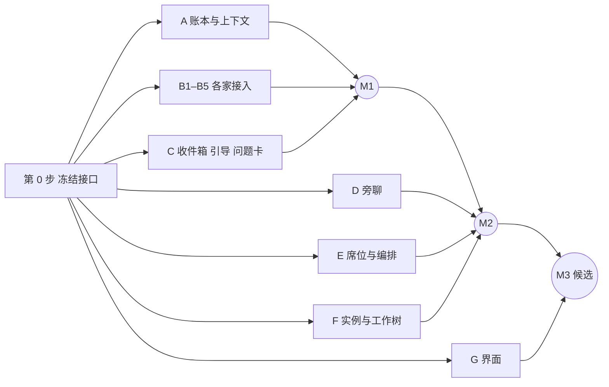

# 37 施工计划（草案）：按分布式施工切分

- 日期：2026-09-26
- 状态：**DESIGN_PROPOSAL / NOT_AUTHORIZED。**本稿只是计划草案，不恢复、不改变 S1-R4 的施工和授权。
- 对应设计：[37 席位与会话架构](37-seat-session-architecture-draft.md)。
- 开工时间：S1-R4 v2 的 R2-05 收口之后。本计划建立在 R2 已交付的实际入口、native-host 进程托管和随包 Node 运行时之上。
- **切法**（[方向候选 §3](../directions/2026-09-23-direction-candidates.md)，Owner 2026-09-23）：
  - 按写入范围切，不按功能切；
  - 先冻结接口，各条线对着接口和假实现并行；
  - 每一块有自己的验收；
  - 不切得太细，因为交接和复核能力都是成本。
- **只切线，不定人**：每条线派给哪家、哪个实例、什么模型，由主控决定（设计 37 §2b），本计划不写。

---

## 1. 现有资产：扩展，不另起一套

设计 37 的对象，代码里多数已经有雏形（`third_party/t3code/apps/server/src/gogoke/contracts/model.ts` 和 native-host 的 `store/authority/`）：

| 设计 37 | 已有 | 要补的 |
|---|---|---|
| 实例 | `RuntimeInstance`（profileRef、authRevision、capacityPoolRef） | 独立家目录、能力清单（原生插话、只追加不回答、自带问题卡）、厂商记忆关闭、版本和"有新版本" |
| 席位模板 | `RoleSpec`（职责、所需能力、可下放上限） | 固定前缀、渲染成各家指令文件、接手必答问题 |
| 席位 | `Seat`（scope、domainId、lifecycle、grantRef） | 用户层或主控层、长期或短期、状态卡、编排范围 |
| 会话 | `NativeBinding` 加 `SessionLineage`（fork、续接的血缘） | 旁聊的 fork 引用（只记主控账本的位置） |
| 上下文作用域 | `ContextObject.scope` 分 GLOBAL/PROJECT/SESSION；`ContextManifest` 管装配和脱敏 | 席位标签、旁聊层、全局存储对项目检索不可达 |
| 进程托管 | native-host `process/`、`store/authority/process_custody.rs`（R2-06a） | 按实例家目录和显式环境变量启动 |
| 工作树、插话 | Tauri 后端 `src-tauri/src/workspaces`、`shared`、`codex`（来自 CodexMonitor，只服务 Codex） | 改由宿主统一建树、分类存放、图谱登记；插话推广到各家 |
| 本地用量 | Tauri 后端 `local_usage.rs` | 按"本地优先、官方接口限频"统一成额度来源（第二批） |
| 收件箱、旁聊、账本事件 | 没有 | 新建 |

## 2. 第 0 步：冻结接口（单线，最先做）

这一步只有一条线，由负责汇合的席位来做，完成并通过复核后，其余各线才开工。

**冻结的内容**：

1. **契约**：在 `contracts/model.ts` 上扩展，扩展的是上一节"要补的"那一列。新增的对象有：
   - `LedgerEvent`：事件词汇采用 ACP `session/update`，每条带作用域、席位、会话三个标签，另加旁聊层；
   - `InboxMessage`：状态按设计 37 附录 A1；
   - `QuestionCard`：问题、几个方案（标出推荐）、自由回答；
   - `TakeoverAnswers`：接手必答问题的答案，每条带依据；
   - `WorktreeNode` 和 `WorktreeEdge`：工作树的关系图谱。
2. **宿主操作**：Node 通过 typed operations 调用 native-host，要冻结的有：
   - 开会话、续接、停止；
   - 投递、引导、取消、编辑；
   - 记事件、按作用域查询；
   - 建树、登记树、合并；
   - 席位的新建、调整、回收（带编排范围检查）。
3. **服务对界面的接口**：界面只调这一层。
4. **每个操作都有一个假实现**，行为符合冻结的语义，各线可以先对着假实现开发。
5. **共享文件的归属**：下列文件在第 0 步之后只由汇合席位改，其他线要改，提交一份变更请求：
   - `contracts/model.ts`；
   - native-host 的 `schema.sql` 和 IPC 协议；
   - 界面的路由和 `App.tsx`；
   - Tauri 命令注册表。

**验收**：
- 编解码和校验的测试全部通过，每个假实现都有测试；
- 独立复核确认冻结的内容覆盖了设计 37 的首版范围（§13a）；
- 冻结以后再改接口，要写变更说明，并通知依赖它的线。

## 3. 可以同时开工的线

第 0 步完成后，下面这些线可以同时开工。**写入范围**是这条线唯一能改的地方，写的都是新目录，互不重叠。

| 线 | 写入范围 | 做什么 | 依赖（没做好前用假实现） | 自己的验收 |
|---|---|---|---|---|
| **A 账本与上下文** | native-host `store/ledger/`（新）；Node `gogoke/ledger/`（新） | 事件落盘、重启对账；各家输出统一成账本事件（借 Paseo）；账本渲染成参考材料（借 claw-orchestrator 的 `handoff.ts`）；作用域查询。项目检索没有通往全局存储的路径 | 第 0 步 | 重启后对账不丢、不重；跨项目查询被拒；**从项目席位查全局存储，结构上查不到**；旁聊层对项目席位不可见 |
| **B1–B5 各家接入** | Node `gogoke/adapters/codex/`、`claude/`、`opencode/`、`grok/`、`antigravity/`（新，**每家一条线**） | 协议解析（借 claw-orchestrator，只搬解析部分）；开会话、续接、插话（不支持就"打断再续接"）；如实报告能力清单；关掉厂商记忆；内容只走 stdin 或文件；环境变量显式构造 | 第 0 步；进程由 native-host 起 | 每家用真实 CLI 跑通开会话、续接、插话或打断续接，并且能力清单跟实测一致；五家互不依赖，可以同时做 |
| **C 收件箱、引导、问题卡** | Node `gogoke/inbox/`（新） | 收件箱（借 claw-orchestrator 的 `inbox-manager.ts`）：排队、引导、取消、编辑；附录 A1 的全部状态；问题卡：厂商自带的直接转，没有的套我们自己的 | 第 0 步；插话能力来自 B（先用假实现） | A1 每个状态和不允许的捷径都有测试；伪造发件人被转义；投递未确认时显示"待核对"，不自动重发 |
| **D 旁聊** | Node `gogoke/sidechat/`（新） | 从主控账本渲染出参考材料来开旁聊；同步先攒着，下次提问时带上，支持只追加的厂商直接追加；按需读本项目其他线程；默认保留、可归档、可删除；只存自己的内容 | 第 0 步；A（先用假实现） | 附录 A3 全部状态；埋进参考材料的指令不被执行；看不到别的项目；删除旁聊不影响主控账本 |
| **E 席位与编排** | native-host `store/seat/`（新）；Node `gogoke/seats/`（新） | 用户层和主控层；编排范围由宿主检查；同时运行上限按本机资源定；模板复制后微调，并渲染成各家指令文件（借 ruler、rulesync）；接手必答问题（答完才能派活）；状态卡；健康信号，自动压缩、自动换会话，只留低调记录 | 第 0 步 | 附录 A2 全部状态；主控越过编排范围、改用户层席位、给自己换实例，都被拒绝；接手问题没答完不能派活 |
| **F 实例与工作树** | native-host `store/instance/`、`store/worktree/`（新） | 每个实例一个独立家目录，关掉厂商记忆；登录状态、版本、"有新版本"，不自动升级；工作树由宿主统一建（照 Codex，放在宿主目录下），单一树和混合树分开放，登记成图谱；主树只能经合并写入，只有被授权的席位能合并 | 第 0 步 | 附录 A4 全部状态；CLI 自己建树时，写到宿主空间之外会被拦；图谱能回答"这棵树从哪来、谁在用、合到了哪里" |
| **G 界面** | 界面 `features/seats/`、`instances/`、`inbox/`、`sidechat/`、`worktree-graph/`（新） | 席位管理页（含工人动态）、实例管理页、收件箱（引导、取消、编辑）、旁聊窗口、问题卡、工作树图谱。只用现有设计令牌和组件原语 | 第 0 步的服务接口（全程先对着假实现） | 附录 A1–A4 的每个状态都能在界面上看到；风格检查：不出现写死的颜色、新字体、新圆角 |

**秘书长（线 H）**不单独开线：它是一个全局席位，由 E 建席位、A 订阅所有账本、C 投递消息组合出来，放在第二个汇合点做。

## 4. 汇合点

| 汇合 | 合进来的线 | 在那里测什么 |
|---|---|---|
| **M1 一个真席位** | A、B（至少一家）、C | 一个真实 CLI 席位开会话、收发收件箱消息、被引导，事件全部进账本，重启后恢复 |
| **M2 项目里跑起来** | 加上 D、E、F，以及 B 的其余几家 | 主控接手（答完必答问题）→ 在编排范围内建下辖席位 → 各自在隔开的工作树里写 → 合并进主树；同时开一个旁聊跟进，同步正常；一个实例服务两个项目，互不串 |
| **M3 候选** | 加上 G 和秘书长 | 全部经真实界面走一遍；秘书长能看到所有项目、能投递，但往项目里发的内容按项目过滤；打出正式安装包，Owner 在 Win11 上验收 |

## 5. 限制并行度的几件事

- **Rust 只能云端编译**：A、E、F 都要改 native-host，只能靠云端 CI 构建和测试，会排队。所以 native-host 这一侧先各自写纯逻辑和测试，尽量少跑完整构建。
- **复核能力**：每条线由一个独立的复核席位验收，同时开的线越多，复核排队越长。线的数量按复核能力来开，不按上表能开多少就开多少。
- **共享文件**：只有汇合席位改。变更请求多了，说明第 0 步冻结得不够，要回头补冻结，不要在各线里绕。
- **真实 CLI 的登录**：B 线和 M1 要用真实实例，每个实例在自己的独立家目录里登录，需要 Owner 本人登录一次（见下一节）。

## 6. Owner 出面预算

| 次数 | 什么时候 | 为什么只有 Owner 能做 |
|---|---|---|
| 1 | 合并本计划的 PR，另开授权 PR 恢复施工 | 计划和授权按现行治理，由 Owner 合并 |
| 2 | B 线和 M1 开始前，在各实例的独立家目录里登录 | 凭证只能 Owner 本人输入（设计 37 附录 A4） |
| 3 | M3 候选，在 Win11 智能应用控制开启时实机验收 | 只有 Owner 的机器能证明 |

除此之外，只有碰到跟设计 37 或已定决定冲突的情况，才由主控或秘书长带着方案和自由回答选项呈给 Owner（设计 37 §8a）。

## 7. 不在本计划里的

- **第二批**：决策登记册、额度的显示和提醒、长期记忆（设计 37 §13a）。等首版的 M3 收口后，另出计划。
- **用法**：岗位怎么设、合并权限给谁、流程怎么走，都是产品化之后用户自己定的，本计划只保证基础设施能做到。
- 每条线派给谁：由主控决定。

## 8. 自检

- 七条线（B 算五条）的写入范围都是新目录，彼此不重叠；共享文件只有汇合席位能改。
- 设计 37 首版范围（§13a）里的每一项都有归属：席位（E、G）、实例（F、G）、会话和账本（A、B）、旁聊（D）、收件箱（C）、秘书长（M3）、主控编排（E）、工作区隔离（F）、首版五家（B1–B5）。
- 本计划不证明任何代码能跑。开工时，由主控把它转成 S1-R4 v2 那种可以机器校验的格式（PLAN.json 和校验脚本），并在接每条线时确认具体文件。
